# Perfumer Studio Webapp UI/UX Audit

## Tujuan Dokumen

Dokumen ini merangkum seluruh UI/UX webapp `Perfumer Studio` dari sisi:

- halaman utama dan route
- fitur inti per halaman
- alur kerja utama
- modal, dialog, dan interaksi kecil
- screenshot visual untuk area yang berhasil dicapture
- catatan struktur produk agar tim bisa audit, redesign, atau handoff dengan lebih mudah

## Screenshot Index

### Dashboard

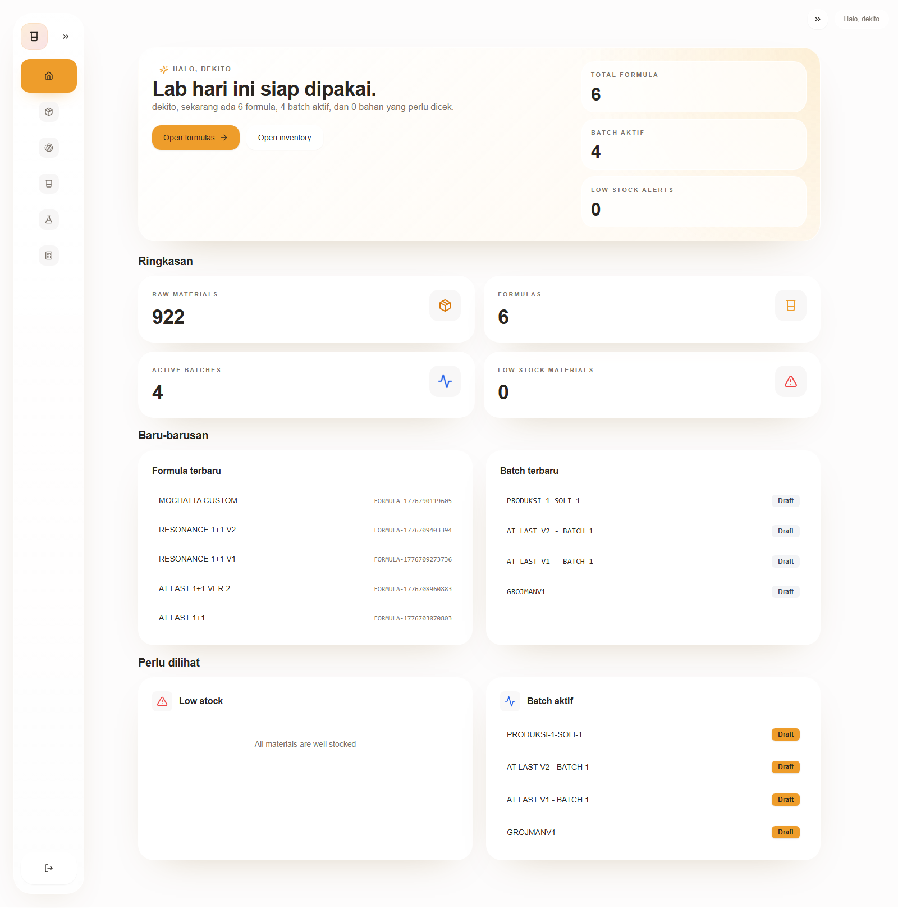

### Raw Materials

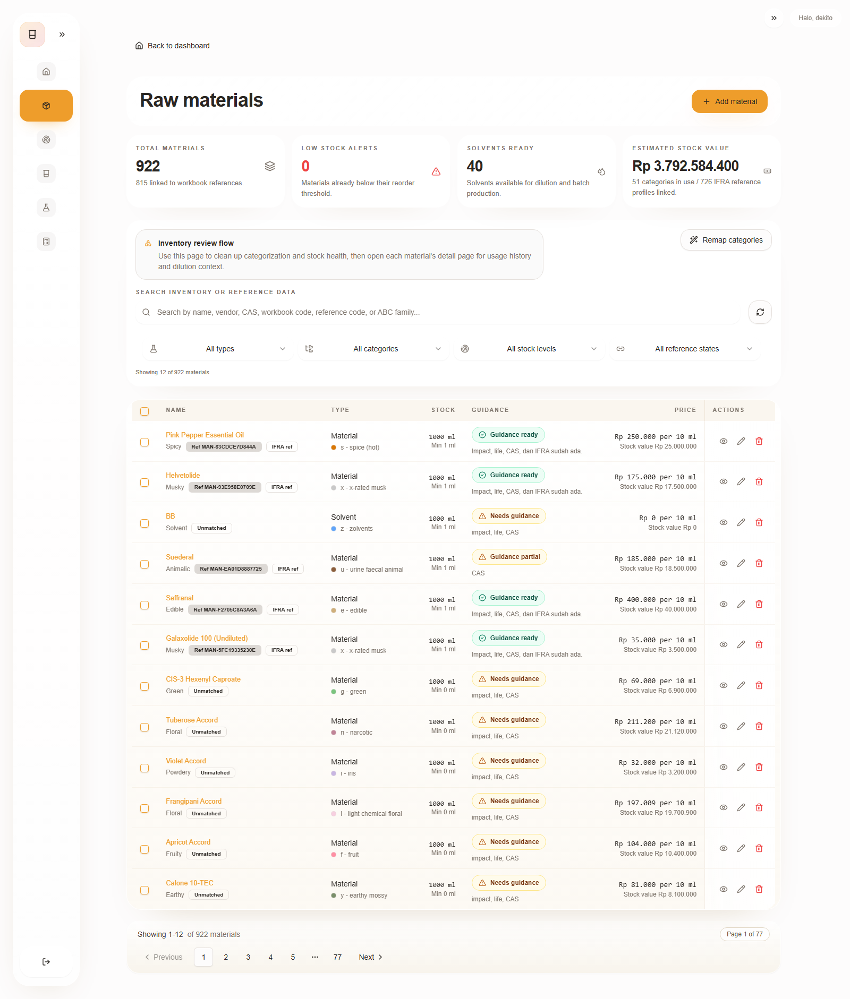

### Raw Material Detail

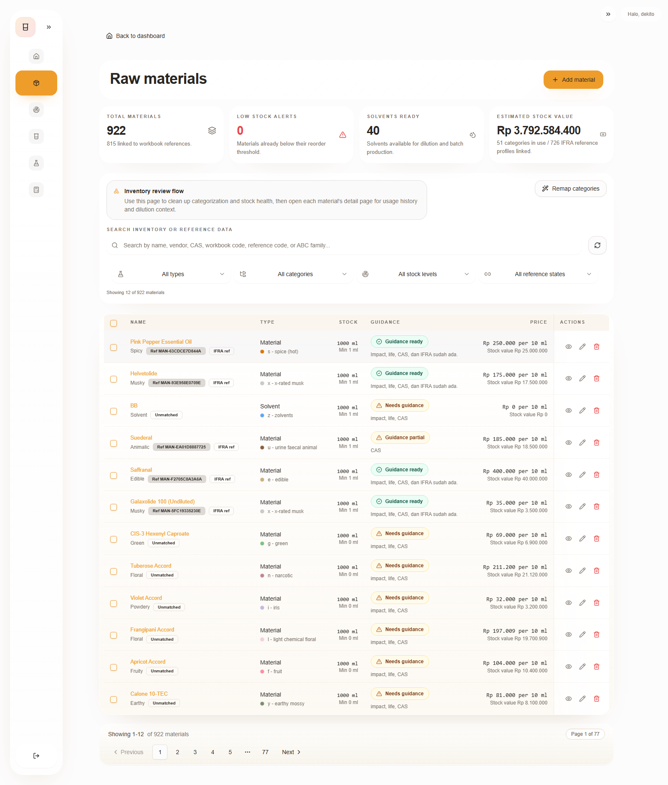

### Raw Material Reference Match Modal

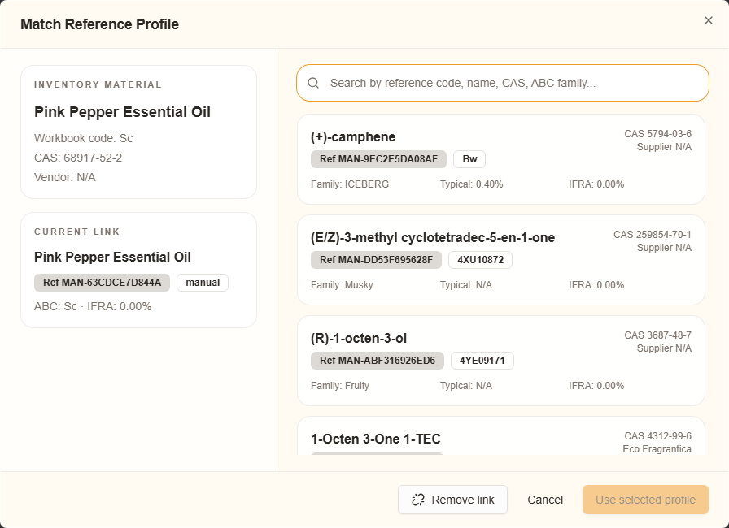

### Material Audit

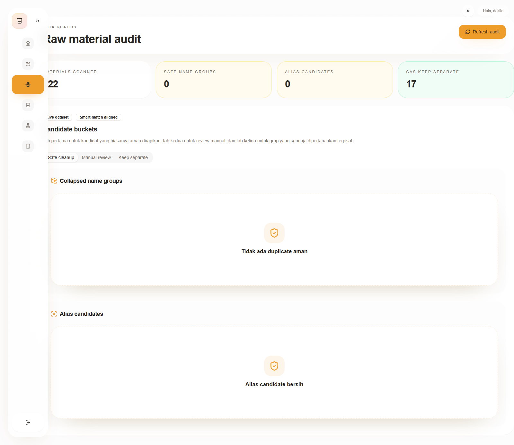

### Formulas

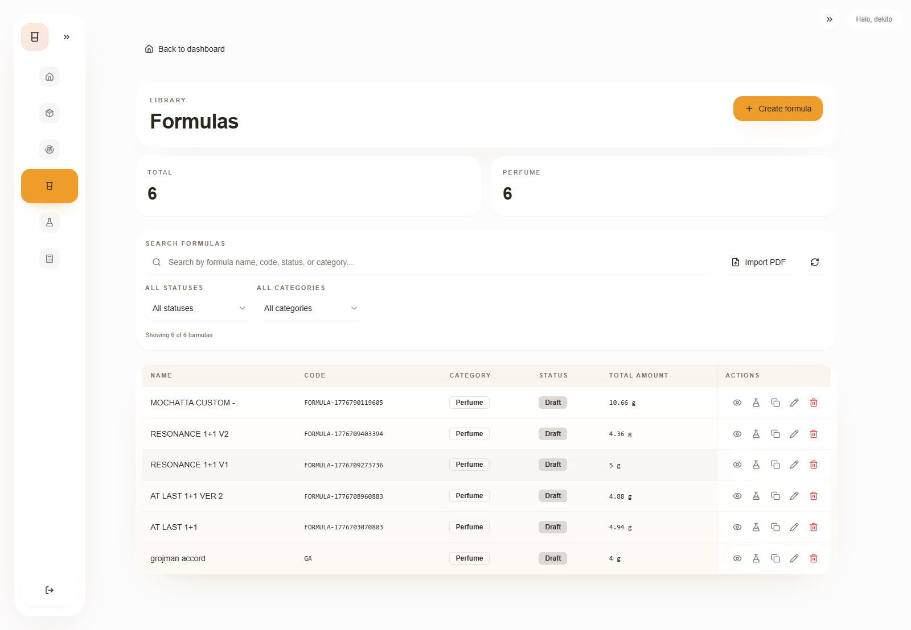

### Formula Create

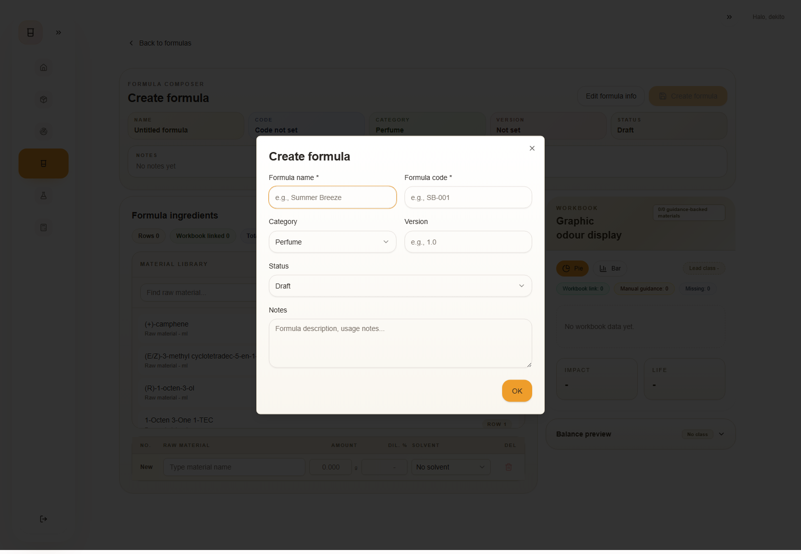

### Formula Import PDF Modal

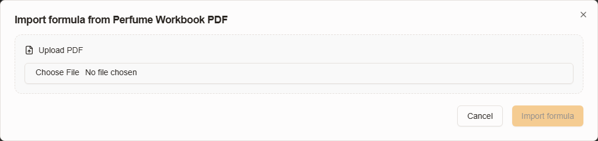

### Batches

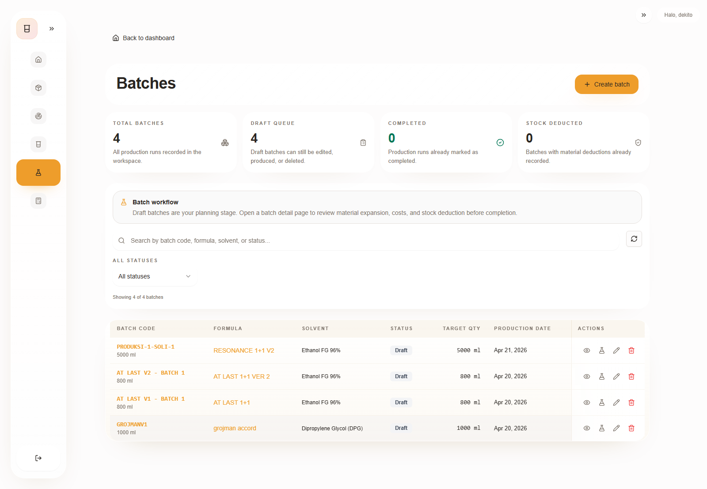

### Batch Detail

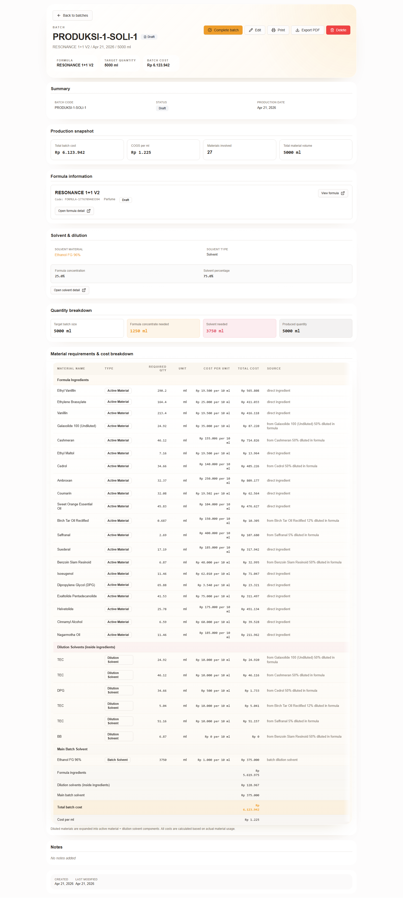

### Production Costing

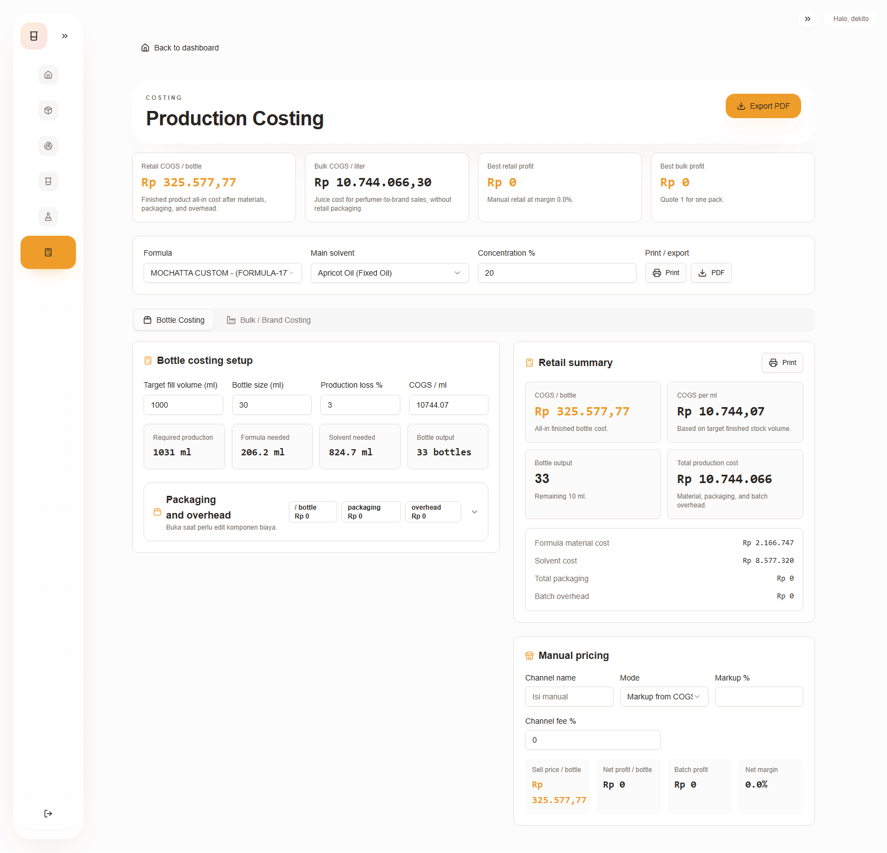

## Route Map

| Route | Halaman | Tujuan |
|---|---|---|
| `/login` | Login | autentikasi user |
| `/dashboard` | Dashboard | ringkasan operasional |
| `/raw-materials` | Raw materials list | inventaris bahan baku |
| `/raw-material-audit` | Material audit | audit duplicate dan alias |
| `/raw-material/:id` | Raw material detail | detail satu material |
| `/formulas` | Formulas list | daftar formula |
| `/formulas/new` | Create formula | composer formula baru |
| `/formulas/:id` | Formula detail | overview, workbook, composition, batches |
| `/formulas/:id/edit` | Edit formula | composer edit formula |
| `/batches` | Batch list | daftar batch produksi |
| `/batches/:id` | Batch detail | expanded composition, cost, stock deduction |
| `/production-costing` | Production costing | costing retail, bulk, quotation |

### Redirect / Legacy

- `/categories` diarahkan ke `/raw-materials`
- `/accords`, `/accord/:id`, `/accords/:id` diarahkan ke `/formulas`

## Shell & Navigasi Global

### App shell

Fitur utama:

- sidebar desktop collapse / expand
- mobile sheet menu
- brand area `Perfumer Studio / Small batch lab`
- session card dan logout
- topbar greeting

Menu utama:

- Dashboard
- Raw materials
- Material audit
- Formulas
- Batches
- Production cost

### Karakter UX global

- visual cenderung soft-lab, warm beige, rounded card, glassy white panel
- navigasi utama fokus ke workflow operasional, bukan ke struktur admin teknis
- list-heavy module memakai card summary + filter toolbar + table/list hybrid

## Halaman Per Halaman

## 1. Login

Tujuan:

- autentikasi user sebelum masuk app

Elemen inti:

- email field
- password field
- submit action
- redirect ke dashboard saat sukses

Flow:

1. user masuk ke `/login`
2. input kredensial
3. submit
4. jika sukses, diarahkan ke `/dashboard`

## 2. Dashboard

Tujuan:

- memberi status operasional cepat untuk hari ini

Bagian utama:

- hero welcome section dengan CTA ke formula dan inventory
- summary cards:
  - raw materials
  - formulas
  - active batches
  - low stock materials
- recent activity:
  - formula terbaru
  - batch terbaru
- operational insight:
  - low stock preview
  - active batch preview

UX notes:

- dashboard dirancang sebagai command center
- CTA utama mendorong user masuk ke `Formulas` atau `Raw materials`
- copy terasa product-facing, bukan terlalu teknis

## 3. Raw Materials List

Tujuan:

- mengelola inventaris material dan guidance secara operasional

Bagian utama:

- page header
- summary cards untuk jumlah material, low stock, solvent, category count, inventory value, reference coverage
- search bar
- filter bar:
  - type
  - category
  - stock
  - reference
- pagination
- bulk selection via checkbox
- table/list material

Action utama:

- add raw material
- edit raw material
- delete raw material
- bulk delete
- open detail
- open workbook guidance quick editor
- remap categories

Status visual penting:

- low stock
- guidance ready / partial / needs guidance
- workbook reference / IFRA ref / unmatched

Field penting di row atau detail list:

- name
- workbook code
- CAS
- family / class
- stock
- price
- guidance status

UX notes:

- list sudah diringkas supaya vendor, reference, kategori tidak membebani tabel utama
- guidance jadi sinyal operasional penting di row
- bulk selection mengarah ke data hygiene dan cleanup cepat

## 4. Add Raw Material Modal

Komponen:

- modal form penuh
- workbook guidance import block

Field utama:

- name
- workbook code
- category
- type
- scent family
- stock quantity
- unit
- cost per unit
- minimum stock
- low stock threshold
- vendor
- description
- CAS
- IFRA
- workbook family
- impact
- life hours
- typical use level
- max use level
- notes
- diluted config

Import sources di modal:

- PerfumersWorld URL
- ScenTree URL
- TGSC URL

Fungsi import:

- autofill workbook code, CAS, family, impact, life, use levels, description
- inference notes / import notes

## 5. Edit Raw Material Modal

Peran:

- versi edit dari form raw material

Fitur:

- field set sama dengan add modal
- memuat nilai existing
- mendukung import dari URL juga
- bisa update diluted config dan guidance values

## 6. Workbook Guidance Quick Edit Dialog

Tujuan:

- mengisi guidance inti tanpa harus masuk form edit penuh

Field fokus:

- workbook code
- CAS
- IFRA
- workbook family
- impact
- life
- typical use
- max use

Sumber import:

- PerfumersWorld URL
- ScenTree URL
- TGSC URL

Perilaku penting:

- menampilkan current values
- menampilkan warning untuk field guidance yang belum lengkap
- jika workbook code bentrok, field lain tetap tersimpan
- workbook code conflict ditampilkan inline agar tidak membingungkan

Dipakai di:

- raw materials page
- create formula
- edit formula
- formula-related guidance edit flow

## 7. Raw Material Detail

Tujuan:

- melihat satu material secara lengkap

Section utama:

- header dengan action:
  - edit
  - match / update reference
  - delete
- snapshot:
  - stock
  - reorder point
  - inventory value
  - usage recorded
- summary:
  - workbook code
  - CAS
  - family
  - IFRA
  - typical use
  - max use
- stock information
- classification
- reference / workbook block
- usage history
- metadata

Modal terkait:

- Edit raw material modal
- Manual reference match modal
- confirm delete dialog

UX notes:

- detail page menjadi tempat semua field tersembunyi dari list utama
- cocok untuk audit material per item

## 8. Material Audit

Tujuan:

- audit data quality live untuk duplicate raw material

Summary cards:

- materials scanned
- safe name groups
- alias candidates
- CAS keep separate

Tab bucket:

- Safe cleanup
- Manual review
- Keep separate

Isi utama:

- collapsed name groups
- alias candidates
- CAS review groups
- CAS keep separate groups

Fungsi:

- memusatkan audit duplicate langsung dari UI
- selaras dengan smart-match guard dan alias cleanup logic

## 9. Formulas List

Tujuan:

- pusat daftar formula

Bagian utama:

- summary cards
- search
- filter:
  - status
  - category
- import PDF
- refresh
- paginated table

Action per formula:

- view detail
- edit
- duplicate
- create batch
- delete

Data yang ditonjolkan:

- name
- code
- category
- status
- total amount

UX notes:

- formulas page berfungsi sebagai library management
- import PDF jadi jalur onboarding formula dari workbook

## 10. Import Formula PDF Modal

Tujuan:

- membaca PDF workbook dan mengubahnya menjadi formula app

Fitur:

- upload PDF
- parse workbook formula
- baca workbook code, item, formula meta
- match ke raw material existing
- deteksi missing materials
- draft material creation bila bahan belum ada
- review missing solvent bila dilution ditemukan

Output:

- formula baru
- raw material baru bila diperlukan
- notes otomatis dari metadata workbook

## 11. Create Formula

Tujuan:

- composer formula baru

Struktur utama:

- metadata dialog
- composer section
- material library
- item table editor
- odour display / workbook simulation
- guidance editor popup
- mobile drawer / tabs

Field metadata:

- name
- code
- category
- version
- status
- notes

Composer behavior:

- satu row composer aktif
- double click material untuk commit cepat
- validasi gram amount
- dilution support per row
- duplicate material guard

Panel kanan / workbook area:

- odour display
- pie / bar workbook guidance
- diagnostics coverage

UX notes:

- create page adalah salah satu flow paling kompleks
- dirancang seperti workstation: compose + preview + guidance

## 12. Edit Formula

Tujuan:

- mengubah formula existing dengan composer yang sama

Perbedaan dari create:

- preload metadata dan formula items existing
- legacy accord items disimpan sebagai hidden context
- update formula, bukan create

Fitur sama:

- formula item table editor
- guidance popup
- mobile tabs / drawer
- workbook visual preview

## 13. Formula Detail

Tujuan:

- halaman baca cepat untuk formula jadi

Tab utama:

- Overview
- Workbook
- Composition
- Batches

### Overview

- item count
- low stock count
- diluted count
- guidance-backed count
- reference alerts
- material cost
- reference guidance cards
- warning / advisory list

### Workbook

- composition board versi compact
- formula ledger
- graphic odour display
- workbook diagnostics

### Composition

- total amount
- total percentage
- material cost
- desktop premium table:
  - Material
  - Guidance
  - Usage
  - Cost

### Batches

- related batches
- link ke batch detail

Action utama:

- create batch
- edit
- print
- export
- delete

UX notes:

- halaman ini sudah dipadatkan agar tidak terlalu panjang vertikal
- workbook tab sekarang lebih seimbang secara layout desktop
- composition desktop dibuat lebih premium dan lebih cepat discan

## 14. Batches List

Tujuan:

- mengelola eksekusi produksi batch

Ringkasan:

- total batches
- draft queue
- completed
- stock deducted

Toolbar:

- search
- status filter
- create batch
- refresh

Action per batch:

- open detail
- edit draft
- produce draft
- delete draft

Modal terkait:

- Create batch modal
- Edit batch modal
- Material requirements modal
- confirm delete dialog

## 15. Create Batch Modal

Tujuan:

- membuat batch baru dari formula

Field / flow utama:

- pilih formula
- pilih solvent
- target quantity
- dilution / concentration review
- submit create batch

Posisi dalam flow:

- bisa dipanggil dari formulas page
- bisa dipanggil dari formula detail

## 16. Batch Detail

Tujuan:

- command center untuk satu run produksi

Bagian utama:

- header actions:
  - complete batch
  - edit
  - print
  - export PDF
  - delete draft
- summary chips
- expanded composition
- formula ingredient, dilution solvent, main batch solvent grouping
- cost breakdown
- usage records
- stock deduction validation
- formula preview dialog

Flow penting:

1. buka batch draft
2. review material requirement
3. validate stock deduction
4. complete batch
5. stock deducted
6. batch pindah ke completed

## 17. Production Costing

Tujuan:

- menghitung HPP dan pricing skenario retail maupun bulk

Tab utama:

- retail
- bulk
- quotation

Fitur:

- pilih formula
- pilih solvent
- input batch volume
- formula percentage
- bottle size
- production loss
- packaging cost breakdown
- labor / overhead / logistics
- retail scenario pricing
- bulk scenario pricing
- quotation builder
- print / export

Persistence:

- scenario disimpan ke localStorage per formula

UX notes:

- ini adalah tool kalkulasi bisnis, bukan cuma inventaris
- lebih dekat ke calculator workspace daripada CRUD page

## Modal, Dialog, dan Popup Inventory

Daftar komponen interaktif penting:

- `AddRawMaterialModal`
- `EditRawMaterialModal`
- `RawMaterialGuidanceQuickEditDialog`
- `ManualReferenceMatchModal`
- `RemapRawMaterialCategoriesModal`
- `ConfirmDialog`
- `AddFormulaModal`
- `EditFormulaModal`
- `FormulaMetadataDialog`
- `ImportFormulaPdfModal`
- `CreateBatchModal`
- `EditBatchModal`
- `MaterialRequirementsModal`
- `DeleteFormulaModal`
- `DeleteBatchConfirmationDialog`
- `DeleteConfirmationDialog`
- mobile navigation `Sheet`
- mobile composer `Drawer`

## Flow Utama Produk

## Flow 1: Raw Material Onboarding

1. user buka `Raw materials`
2. klik `Add raw material`
3. isi manual atau import URL
4. set stock, unit, cost, category
5. simpan
6. jika perlu, lengkapi `Workbook guidance`
7. material muncul di library dan formula composer

## Flow 2: Workbook Guidance Enrichment

1. buka material dari list atau formula composer
2. buka `Workbook guidance`
3. import dari PerfumersWorld / ScenTree / TGSC
4. review workbook code, CAS, IFRA, impact, life, use level
5. simpan
6. guidance status berubah di list dan dipakai di workbook visual

## Flow 3: Formula Creation

1. buka `Formulas`
2. klik `Create formula`
3. isi metadata
4. pilih material dari library
5. isi gram amount
6. atur dilution jika perlu
7. lihat workbook / odour preview
8. simpan
9. lanjut ke detail formula

## Flow 4: Formula Import from PDF

1. buka `Formulas`
2. klik `Import PDF`
3. upload workbook PDF
4. sistem parse item dan metadata
5. review missing raw material / solvent
6. buat raw material yang belum ada jika diperlukan
7. submit
8. formula baru terbentuk

## Flow 5: Batch Production

1. buka formula atau batches
2. klik `Create batch`
3. pilih formula + solvent + quantity
4. buka `Batch detail`
5. review expanded composition dan cost
6. validate stock deduction
7. complete batch
8. stok material berkurang dan batch selesai

## Flow 6: Production Costing

1. buka `Production cost`
2. pilih formula
3. isi retail atau bulk assumptions
4. review COGS, packaging, overhead, margin
5. buat quotation bila perlu
6. print / export

## Flow 7: Data Quality / Duplicate Cleanup

1. buka `Material audit`
2. review tab:
   - safe cleanup
   - manual review
   - keep separate
3. buka raw material terkait
4. merge / cleanup lewat proses data hygiene yang sesuai

## Peta Nilai UX Saat Ini

Kekuatan:

- workflow operasional sudah jelas: material -> formula -> batch -> costing
- workbook guidance jadi lapisan intelligence yang terasa khas
- data quality tooling sudah mulai masuk ke UI, bukan lagi murni script
- formula composer sudah kuat untuk desktop maupun mobile

Hal yang perlu dijaga:

- module formula dan workbook mudah jadi padat jika semua insight ditampilkan sekaligus
- consistency antara list status dan detail guidance perlu terus dijaga
- modal importer perlu tetap sederhana meski source makin banyak
- production costing perlu dijaga agar tidak terasa terlalu spreadsheet-heavy

## File & Artefak Pendukung

Halaman utama:

- `apps/web/src/App.jsx`
- `apps/web/src/components/AppShell.jsx`

Screenshot assets:

- `docs/uiux-audit-assets/`

Capture script:

- `apps/web/tools/capture-uiux-doc-assets.mjs`

## Kesimpulan

Webapp ini secara struktur adalah sistem operasi kecil untuk studio parfum:

- `Raw materials` mengelola library dan readiness bahan
- `Formulas` mengelola racikan
- `Batches` mengelola eksekusi produksi
- `Production cost` mengelola ekonomi produk
- `Material audit` mengelola kualitas data

Secara UX, inti kekuatan app ada pada integrasi antara data inventaris, workbook guidance, dan composer formula. Dokumen ini bisa dipakai sebagai dasar untuk:

- audit redesign
- handoff ke designer / developer
- penyusunan product requirements
- QA walkthrough
- dokumentasi operasional internal
